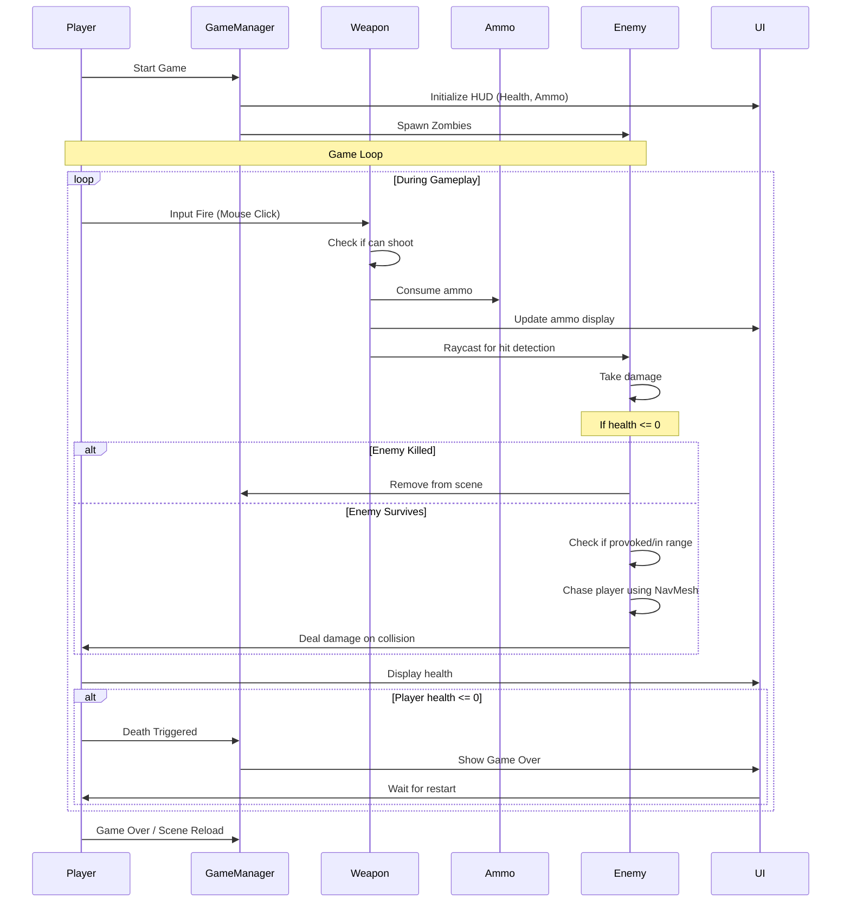

# Zombie Runner

## Overview

**Zombie Runner** is a first-person shooter survival game where players must defend themselves against waves of zombies using various weapons and survival mechanics. The game combines fast-paced action with resource management, requiring players to scavenge ammo and manage their health while fending off intelligent AI-driven zombie enemies.

## Game Features

### Core Gameplay
- **First-Person Shooter Mechanics**: Fast-paced combat with responsive weapon systems
- **Multiple Weapons**: Switch between different weapons with unique characteristics
- **Intelligent Enemy AI**: Zombies use NavMesh pathfinding to hunt the player, with detection and provocation systems
- **Weapon Zoom**: Zoom capability for precise aiming and long-range engagements
- **Flashlight System**: Battery-powered flashlight for navigating dark environments

### Player Systems
- **Health Management**: Track and manage player health; game ends when health reaches zero
- **Ammo System**: Limited ammunition with different ammo types for various weapons
- **Damage Feedback**: Visual indicators showing damage received
- **Weapon Switching**: Dynamic weapon switching during combat

### Enemy Systems
- **Zombie AI**: Enemies patrol and chase the player within detection range
- **Enemy Health**: Zombies can be damaged and eliminated
- **Enemy Attacks**: Enemies deal damage to the player on contact
- **Animation System**: Idle and attack animations for realistic enemy behavior

### Pickup System
- **Ammo Pickups**: Scattered throughout the environment to replenish ammunition
- **Battery Pickups**: Power batteries for the flashlight system
- **Scavenging Mechanic**: Players must explore to find resources

## Project Structure

```
Zombie Runner/
├── Assets/
│   ├── Animations/          # Character and enemy animations
│   ├── Asset Packs/         # External asset packs (carbine, zombies, textures)
│   ├── Materials/           # Game materials (sky, physics, emissive)
│   ├── Prefabs/             # Reusable game objects
│   ├── Scenes/              # Game scenes and levels
│   └── Scripts/             # C# game logic
├── Packages/                # Unity package dependencies
├── ProjectSettings/         # Unity project configuration
└── Zombie Runner.sln        # Visual Studio solution file
```

## Scripts Overview

### Player Scripts
- **`PlayerHealth.cs`**: Manages player health points and death handling
- **`Weapon.cs`**: Handles shooting mechanics, damage, and ammo management
- **`WeaponSwitcher.cs`**: Manages weapon selection and switching
- **`WeaponZoom.cs`**: Implements camera zoom functionality
- **`FlashLightSystem.cs`**: Controls flashlight activation and battery consumption
- **`DisplayDamage.cs`**: Shows visual feedback for player damage

### Enemy Scripts
- **`EnemyAI.cs`**: Implements zombie pathfinding and chase logic using NavMesh
- **`EnemyAttack.cs`**: Handles enemy attack detection and damage
- **`EnemyHealth.cs`**: Manages enemy health and death

### Resource Management
- **`Ammo.cs`**: Represents ammunition objects with properties
- **`AmmoType.cs`**: Defines different ammunition types
- **`AmmoPickup.cs`**: Handles ammo pickup collection
- **`BatteryPickup.cs`**: Handles battery pickup collection

### Utility Scripts
- **`SceneLoader.cs`**: Manages scene transitions and game state
- **`DeathHandler.cs`**: Handles player death events and game over

## Technologies Used

### Game Engine
- **Unity** - Core game development engine
- **C#** - Primary programming language

### Unity Modules & Features
- **UI System (UGUI)** - User interface elements
- **TextMesh Pro** - Advanced text rendering
- **Navigation (AI)** - NavMesh-based pathfinding for enemy AI
- **Physics** - 3D physics simulation for collision detection
- **Animation** - Character and enemy animation system
- **Particle System** - Visual effects (muzzle flash, impact effects)
- **ProBuilder** - Level design and geometry creation

### External Assets
- **Survival Carbine** - Weapon asset pack by Michael Randall
- **Muzzle Flash VFX** - Visual effects for gun fire
- **Standard Assets** - Common game development components
- **Custom Zombie Models & Textures**

### Development Tools
- **Visual Studio** / **Rider** - Code editor integration
- **ProGrids** - Snapping and alignment tools for level design
- **Purchasing Module** - In-game monetization support

## Application Flow



## Getting Started

### Prerequisites
- Unity (2019.3 or later recommended based on package versions)
- Visual Studio or Rider IDE
- Git for version control

### Installation
1. Clone or download the repository
2. Open the project in Unity
3. Navigate to `Scenes/` and open the main game scene
4. Press Play to start the game

### Controls
- **WASD** - Movement
- **Mouse Movement** - Look around
- **Left Click** - Shoot
- **Number Keys or Mouse Wheel** - Switch weapons
- **Right Click** - Zoom (when applicable)
- **F** - Toggle flashlight (if implemented)

## Game Mechanics

### Combat System
- Players aim with the mouse and click to shoot
- Each weapon has specific damage, range, and fire rate
- Different ammo types may affect weapon performance
- Visual feedback includes muzzle flashes and hit effects

### Enemy Behavior
- Zombies patrol when unaware of the player
- Entering detection range (5 units by default) or taking damage triggers pursuit
- Enemies use NavMesh pathfinding to intelligently navigate to the player
- Proximity-based attacks deal damage to the player

### Resource Management
- Limited ammunition requires strategic ammo pickups
- Flashlight battery drains over time
- Health recovery may be limited, requiring careful play

## Credits
- Asset packs: Michael Randall (Survival Carbine), Muzzle Flash VFX
- Game mechanics inspired by survival shooter genre
